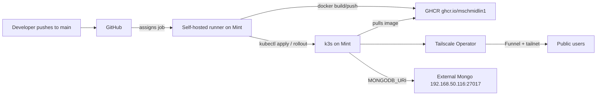

# Kubernetes Auto-Deploy Setup

Auto-deploy from `git push main` → GHCR → k3s on a Linux Mint host, exposed via the Tailscale Kubernetes Operator, using a self-hosted GitHub Actions runner on the Mint box. MongoDB stays external.

## Architecture



Key choices: **k3s** (single binary, Traefik bundled, lightweight), **self-hosted runner** (no inbound exposure, builds locally), **GHCR** (free, native to GitHub Actions), **Tailscale Operator Ingress** with Funnel (no port forwarding, end-to-end encrypted, custom-domain support via CNAME), **external MongoDB** (reuse existing instance).

---

# Section 1 — What you do on the Linux Mint box

Do these in order. All commands assume Mint 21/22 with sudo.

### 1.1 Base packages

```bash
sudo apt update && sudo apt upgrade -y
sudo apt install -y curl ca-certificates git apt-transport-https jq
```

### 1.2 Install Docker (the self-hosted runner needs it to build the image)

```bash
curl -fsSL https://get.docker.com | sh
sudo usermod -aG docker $USER
newgrp docker   # or log out/in
docker run --rm hello-world
```

### 1.3 Install k3s

```bash
curl -sfL https://get.k3s.io | sh -
# kubeconfig for your user (k3s keeps the original at /etc/rancher/k3s/k3s.yaml as root-only)
mkdir -p ~/.kube
sudo cp /etc/rancher/k3s/k3s.yaml ~/.kube/config
sudo chown $USER:$USER ~/.kube/config
chmod 600 ~/.kube/config
# k3s's /usr/local/bin/kubectl shim defaults to the root-only file, not ~/.kube/config
export KUBECONFIG=$HOME/.kube/config
echo 'export KUBECONFIG=$HOME/.kube/config' >> ~/.bashrc
source ~/.bashrc
sed -i "s/127.0.0.1/$(hostname -I | awk '{print $1}')/" ~/.kube/config  # optional; only if kubectl from another machine on LAN
kubectl get nodes   # should show one Ready node (e.g. STATUS Ready, ROLES control-plane)
```

If `kubectl` still reports `permission denied` on `/etc/rancher/k3s/k3s.yaml`, confirm `echo $KUBECONFIG` prints `/home/<you>/.kube/config` and that `~/.kube/config` exists. As a one-off: `kubectl --kubeconfig=$HOME/.kube/config get nodes`.

### 1.4 Install Tailscale on the host

```bash
curl -fsSL https://tailscale.com/install.sh | sh
sudo tailscale up
tailscale status
```

Note your tailnet name (e.g. `tail1234.ts.net`) — you'll need it. If this is a new tailscale account you will need to go to tailscale.com and set it up. You can find your tailnet name under the "DNS" section in the website.

### 1.5 Install Helm and the Tailscale Kubernetes Operator

You'll first need to define ACL tags and create an OAuth client in the Tailscale admin console — see Section 3.2 (tags first, then OAuth). Come back here after that.

```bash
curl https://raw.githubusercontent.com/helm/helm/main/scripts/get-helm-3 | bash
helm repo add tailscale https://pkgs.tailscale.com/helmcharts
helm repo update
helm upgrade --install tailscale-operator tailscale/tailscale-operator \
  --namespace=tailscale --create-namespace \
  --set-string oauth.clientId="<paste from web step>" \
  --set-string oauth.clientSecret="<paste from web step>" \
  --set-string apiServerProxyConfig.mode="true"
kubectl get pods -n tailscale   # operator pod should be Running
kubectl get ingressclass        # should list "tailscale"
```

### 1.6 Install the GitHub self-hosted runner

Complete **Section 3.1 step 3** first so the runner registration page is open. On **Settings → Actions → Runners → New self-hosted runner → Linux x64**, GitHub shows a **Configure** section with shell commands. Paste those lines from GitHub — do not run the example-shaped lines below.

**Run on the Mint box** (in order):

```bash
mkdir -p ~/actions-runner && cd ~/actions-runner
```

```bash
# Copy from GitHub Configure — the command that starts with `curl -o actions-runner-linux-x64` (example only; paste yours from GitHub):
# curl -o actions-runner-linux-x64-2.331.0.tar.gz -L https://github.com/actions/runner/releases/download/v2.331.0/actions-runner-linux-x64-2.331.0.tar.gz

# Copy from GitHub Configure — the command that starts with `tar xzf ./actions-runner-linux-x64` (example only; paste yours from GitHub):
# tar xzf ./actions-runner-linux-x64-2.331.0.tar.gz

# Copy from GitHub Configure — the command that starts with `./config.sh --url` (one-time token; paste yours from GitHub):
# ./config.sh --url https://github.com/mschmidlin1/ResumeCustomizer --token EXAMPLE_TOKEN_DO_NOT_USE
```

After you run `./config.sh`, it prompts for runner group, runner name, labels, and work folder. **Press Enter at each prompt** to accept the defaults (Default runner group, hostname as runner name, built-in labels including `self-hosted`, and `_work` as the work folder). That is enough for this guide — the deploy workflow only needs `runs-on: self-hosted`.

When `config.sh` finishes, install and start the service (from the runner install directory):

```bash
cd ~/actions-runner
sudo ./svc.sh install
sudo ./svc.sh start
sudo ./svc.sh status
```

Ensure the runner's user (your login user) is in the `docker` group and has `~/.kube/config` plus `KUBECONFIG=$HOME/.kube/config` in `~/.bashrc` (Section 1.3).

### 1.7 Create namespace and pre-stage cluster

```bash
kubectl create namespace resume-customizer
```

That's the entire host-side setup. Everything else flows from CI.

---

# Section 2 — What lives in this repo

The following files will be added to this repo (when you say "go"). Final layout:

```
.github/workflows/deploy.yml   # build + push + kubectl apply on every push to main
k8s/namespace.yaml             # safety; idempotent
k8s/deployment.yaml            # 1 replica, image tag templated, mounts secrets.toml from Secret
k8s/service.yaml               # ClusterIP on port 80 -> pod 8501
k8s/ingress.yaml               # Tailscale Operator Ingress with funnel + custom hostname
k8s/kustomization.yaml         # ties the above together
k8s/secret.example.yaml        # documents the Secret shape; real Secret is generated by CI
```

### 2.1 `.github/workflows/deploy.yml`

Job header (the runner service does not source `~/.bashrc`, so set `KUBECONFIG` on the job — see Section 1.6):

```yaml
jobs:
  deploy:
    runs-on: self-hosted
    env:
      KUBECONFIG: /home/mike/.kube/config
```

- Triggers on `push: branches: [main]` and `workflow_dispatch`.
- `runs-on: self-hosted` (your Mint runner).
- Job-level `env.KUBECONFIG: /home/mike/.kube/config` so every `kubectl` step uses the user-owned kubeconfig from Section 1.3 (Secret create/apply, `kubectl apply -k`, `kubectl set image`, `kubectl rollout status`). Required because the runner runs as a system service and does not inherit `~/.bashrc`; manual `kubectl` on the host still relies on the bashrc export from Section 1.3.
- Permissions: `contents: read`, `packages: write`.
- Steps:
  1. Checkout.
  2. `docker login ghcr.io` using `${{ secrets.GITHUB_TOKEN }}`.
  3. `docker build -t ghcr.io/mschmidlin1/resumecustomizer:${{ github.sha }} -t ghcr.io/mschmidlin1/resumecustomizer:latest .`
  4. `docker push` both tags.
  5. Render and apply the Kubernetes Secret from GitHub secrets (so the source of truth is GitHub):

     ```bash
     kubectl -n resume-customizer create secret generic resume-customizer-secrets \
       --from-literal=MONGODB_URI="$MONGODB_URI" \
       --from-literal=RESUME_CUSTOMIZER_DB="$RESUME_CUSTOMIZER_DB" \
       --from-literal=secrets.toml="$(printf '[auth]\npassword = "%s"\n\n[anthropic]\napi_key = "%s"\n' "$APP_AUTH_PASSWORD" "$ANTHROPIC_API_KEY")" \
       --dry-run=client -o yaml | kubectl apply -f -
     ```

  6. `kubectl apply -k k8s/` to apply manifests.
  7. `kubectl set image deployment/resume-customizer app=ghcr.io/mschmidlin1/resumecustomizer:${{ github.sha }} -n resume-customizer`.
  8. `kubectl rollout status deployment/resume-customizer -n resume-customizer --timeout=5m` (fails the build if rollout fails).

### 2.2 `k8s/deployment.yaml` highlights

- `replicas: 1` (Streamlit holds per-session state; one pod is correct here).
- Single container `app` from `ghcr.io/mschmidlin1/resumecustomizer:latest` (CI bumps to SHA via `kubectl set image`).
- `imagePullSecrets` only if the GHCR package is private (planning for **public package** by default).
- Mount `secrets.toml` from the Secret onto `/app/.streamlit/secrets.toml` (read-only). This matches how the app reads it today (`.streamlit/secrets.toml.example` shape) so no app code changes are needed.
- `env:` pulled from the same Secret for `MONGODB_URI` and `RESUME_CUSTOMIZER_DB` (the values the `Dockerfile` and `docker-compose.yml` currently expect).
- Liveness/readiness probes hit Streamlit's `/_stcore/health` on 8501.
- Modest resource requests/limits (e.g. 250m CPU / 512Mi req, 1 CPU / 2Gi limit).

### 2.3 `k8s/service.yaml`

ClusterIP, `port: 80 -> targetPort: 8501`, selector matching the Deployment.

### 2.4 `k8s/ingress.yaml` (Tailscale Operator)

```yaml
apiVersion: networking.k8s.io/v1
kind: Ingress
metadata:
  name: resume-customizer
  namespace: resume-customizer
  annotations:
    tailscale.com/funnel: "true"     # publicly reachable via Tailscale Funnel
spec:
  ingressClassName: tailscale
  defaultBackend:
    service:
      name: resume-customizer
      port:
        number: 80
  tls:
    - hosts: ["resume-customizer"]    # operator serves this on <hosts[0]>.<tailnet>.ts.net
```

Result: app reachable on the public internet at `https://resume-customizer.<your-tailnet>.ts.net` with auto-issued TLS, **no port forwarding, no public IP exposed**.

**Custom domain caveat**: Tailscale auto-TLS only covers `*.ts.net`. To use `resume.yourdomain.com`, the standard path is to add a CNAME `resume.yourdomain.com -> resume-customizer.<tailnet>.ts.net` — but browsers will then see a cert-name mismatch. Two options if you want a fully custom URL in browsers:

- (a) Keep using the `*.ts.net` URL (simplest; works immediately).
- (b) Add cert-manager + Let's Encrypt DNS-01 and switch to a separate ingress controller for that host; this is meaningfully more work and is best done as a follow-up after the base pipeline is green.

The initial implementation uses (a); (b) can be layered on later.

### 2.5 `k8s/kustomization.yaml`

Lists the four manifests above so `kubectl apply -k k8s/` is one call.

### 2.6 `k8s/secret.example.yaml`

Documentation-only YAML mirroring what CI creates, so the shape is discoverable in the repo without leaking values.

### 2.7 Confirming no app code changes

The app already reads `.streamlit/secrets.toml`, `MONGODB_URI`, and `RESUME_CUSTOMIZER_DB`, all of which we satisfy via the mounted Secret + env. The current `Dockerfile` and `.dockerignore` are deploy-ready as-is; no edits required.

### 2.8 Branching

Work happens on a feature branch (e.g. `kubernetes-setup`), then a PR merges to `main`. The workflow only fires on pushes to `main`, so the merge itself is the first deploy.

---

# Section 3 — What you do on GitHub's website (and tailscale.com)

### 3.1 On github.com/mschmidlin1/ResumeCustomizer

1. **Settings → Actions → General**: ensure Actions are enabled. Under **Workflow permissions**, set **Read and write permissions** (lets the workflow push to GHCR). Under **Approval for running fork pull request workflows from contributors**, select **Require approval for all external contributors**, then click **Save**. This blocks fork PRs from running any workflow (including malicious `.github/workflows/` added in the PR branch) until a maintainer reviews and approves. Do not use `pull_request_target` in your workflows — it bypasses this approval.
2. **Settings → Branches → Add branch protection rule** (or edit the existing rule for `main`):
   - Branch name pattern: `main`
   - Enable **Require a pull request before merging** (no direct pushes to `main`; the deploy workflow only runs after merge).
   - Enable **Require approvals** if you want a second pair of eyes before deploys (recommended for a solo project you can set to 0 or 1 approval as you prefer).
   - Optionally enable **Require status checks to pass** once CI exists; skip until the first workflow is green.
   - Click **Create** or **Save changes**.
3. **Settings → Actions → Runners → New self-hosted runner → Linux x64**: leave this page open. Under **Configure**, copy the `curl`, `tar`, and `./config.sh` command blocks onto the Mint box (Section 1.6). Do not type URLs or tokens by hand — paste from GitHub.
4. **Settings → Secrets and variables → Actions → New repository secret**, add:
   - `ANTHROPIC_API_KEY` — your Claude API key
   - `APP_AUTH_PASSWORD` — the sign-in password the Streamlit app checks
   - `MONGODB_URI` — e.g. `mongodb://192.168.50.116:27017`
   - `RESUME_CUSTOMIZER_DB` — e.g. `resume_customizer`
5. **(After first successful push)** go to your profile → Packages → `resumecustomizer`, and either keep it public (simpler; recommended) or set it private and add a Personal Access Token / GHCR pull secret to the cluster.

### 3.2 On login.tailscale.com (admin console)

Do these in order. **Define ACL tags before creating the OAuth client** (section 3.2.1) — the operator and proxy devices rely on those tags via ACL ownership.

#### 3.2.1 Access controls — define tags

Open [Access controls](https://login.tailscale.com/admin/acls) (left sidebar → **Access controls**).

**Visual editor (recommended):**

1. Select the **Visual editor** tab, then the **Tags** tab.
2. **Add tag** → name `k8s-operator` (no `tag:` prefix) → owners `autogroup:admin` (or **Admins**) → **Save tag**.
3. **Add tag** again → name `k8s` → owners `tag:k8s-operator` → **Save tag**.
4. Confirm both tags appear in the Tags table, then save the policy if prompted.

**JSON editor (alternative):** switch to the **JSON editor** tab and merge a `tagOwners` block into your existing policy (do not replace other rules):

   ```jsonc
   "tagOwners": {
     "tag:k8s-operator": ["autogroup:admin"],
     "tag:k8s":          ["tag:k8s-operator"]
   }
   ```

| Tag | Purpose |
|-----|---------|
| `tag:k8s-operator` | The operator pod registers itself with this tag |
| `tag:k8s` | Ingress/proxy pods get this tag; the operator may assign it because it owns `tag:k8s` |

#### 3.2.2 Trust credentials — create OAuth client

Open [Trust credentials](https://login.tailscale.com/admin/settings/trust-credentials) (**Settings** → **Trust credentials**). OAuth clients are no longer under Personal Settings.

1. Click **Credential** → **OAuth**.
2. In step 2, open the scope preset dropdown at the top of the page and select **All-read and write**. The tag fields disappear — that is expected. This preset grants write access to everything the operator needs (including auth key creation for `tag:k8s-operator` and proxy devices). Do not choose **All-read** (read-only is not enough).
3. Click **Generate credential**. Copy the **Client ID** and **Client secret** immediately — the secret is shown only once. They go into the Helm install in Section 1.5.

#### 3.2.3 DNS and Funnel

Funnel needs two DNS toggles plus an ACL permission for `tag:k8s` proxy devices. There is no Funnel toggle on the DNS page itself.

**DNS page** — open [DNS](https://login.tailscale.com/admin/dns) (left sidebar → **DNS**) and enable:

1. **MagicDNS** (required for `*.ts.net` hostnames).
2. **HTTPS certificates** (required for TLS on ingress).

**Access controls — allow Funnel for k8s proxies** — return to [Access controls](https://login.tailscale.com/admin/acls). Funnel permission is a **node attribute**, not a DNS setting.

**Visual editor (recommended):**

1. Select the **Visual editor** tab.
2. Scroll the section tabs to the bottom and select **Node attributes** (easy to miss — it is the last tab in the list).
3. **Add node attribute**:
   - **Targets:** `tag:k8s`
   - **Attributes:** `funnel`
4. **Save node attribute**, then save the policy if prompted.

If you already have a Funnel rule for `autogroup:member` (e.g. from **Add Funnel to policy**), keep it — but you still need the `tag:k8s` rule above. Tagged proxy devices are not members, so member-only Funnel permission is not enough for the Kubernetes operator.

**JSON editor (alternative):** switch to the **JSON editor** tab and merge into your existing policy:

   ```jsonc
   "nodeAttrs": [
     {
       "target": ["tag:k8s"],
       "attr":   ["funnel"]
     }
   ]
   ```

If `"nodeAttrs"` already exists, append this entry to the array rather than replacing the whole block.

---

## End-to-end verification (after all three sections)

1. Push a trivial change to `main`.
2. Watch the run at `github.com/mschmidlin1/ResumeCustomizer/actions` — it should run on your self-hosted runner.
3. On the Mint box: `kubectl get pods -n resume-customizer -w` — see new ReplicaSet roll out.
4. `kubectl get ingress -n resume-customizer` — should show the Tailscale-provisioned hostname.
5. Open `https://resume-customizer.<your-tailnet>.ts.net` in any browser — app should load with a valid cert.
6. Roll back drill: `kubectl rollout undo deployment/resume-customizer -n resume-customizer`.

## Day-2 operations

- **Tail logs**: `kubectl logs -n resume-customizer deploy/resume-customizer -f`
- **Restart pod**: `kubectl rollout restart deployment/resume-customizer -n resume-customizer`
- **Roll back to previous revision**: `kubectl rollout undo deployment/resume-customizer -n resume-customizer`
- **Force a redeploy without a code change**: re-run the workflow from the Actions tab (`workflow_dispatch`).

## Risks / things to know

- **Build CPU on the server**: the TeX Live layer is heavy; first build is several minutes. Subsequent builds reuse Docker layer cache on the runner.
- **GHCR package visibility**: planning public by default. If you want private, the Deployment will need a `regcred` Secret + `imagePullSecrets`.
- **Custom-domain TLS**: as noted in 2.4, fully-trusted browser certs on a non-`*.ts.net` domain need cert-manager. Planning for the `*.ts.net` URL first.
- **External Mongo connectivity from k3s pods**: pods on the same Mint box can reach `192.168.50.116:27017` over LAN; nothing extra needed beyond the existing firewall rule on the Mongo host.
