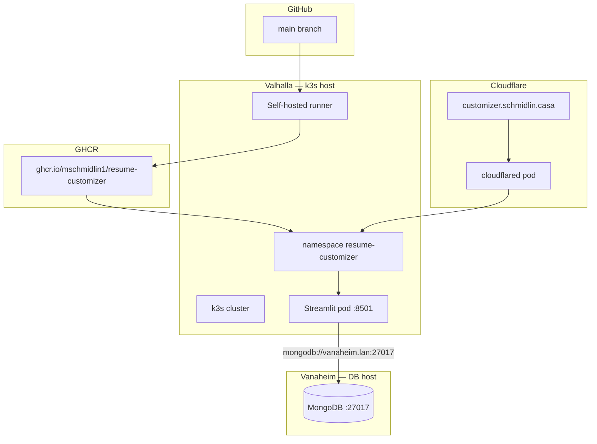

# Deployment Guide — `customizer.schmidlin.casa`

This guide walks through deploying **Resume Customizer** to the same homelab stack used by [Valhalla Landing Page](https://github.com/mschmidlin1/ValhallaLandingPage) and [Dr. JAM](https://github.com/mschmidlin1/dr-jam): a **self-hosted GitHub Actions runner** on **Valhalla**, **Docker** images on **GHCR**, **k3s** on Valhalla, public HTTPS via the existing **Cloudflare Tunnel** (`cloudflared`), and **MongoDB on Vanaheim** (Rocky Linux 10).

**Target URL:** `https://customizer.schmidlin.casa`

**Prerequisites (already in place from Valhalla / Dr. JAM):**

- k3s cluster running on **Valhalla** with `kubectl` working
- `cloudflared` pod healthy in the `cloudflared` namespace
- `schmidlin.casa` **Active** in Cloudflare with SSL/TLS mode **Full**
- You can SSH to Valhalla and run `kubectl`

For background on how those pieces fit together, see the Valhalla docs at `~/repos/valhallalandingpage/docs/` — especially [Self-Hosting.md](https://github.com/mschmidlin1/ValhallaLandingPage/blob/main/docs/Self-Hosting.md) and [CustomDomainSetup.md](https://github.com/mschmidlin1/ValhallaLandingPage/blob/main/docs/CustomDomainSetup.md).

> **Note:** An earlier draft in [`KubernetesSetup.md`](KubernetesSetup.md) described a **Tailscale Operator** ingress. This deployment follows the **Cloudflare Tunnel** pattern instead (same as Dr. JAM) so the public URL is a normal `*.schmidlin.casa` hostname with no cert-name mismatch.

---

## Summary

| Item | Value |
|------|-------|
| **Public URL** | `https://customizer.schmidlin.casa` |
| **GitHub repo** | `github.com/mschmidlin1/ResumeCustomizer` |
| **Deploy trigger** | Push to `main` (or manual workflow run) |
| **GHCR image** | `ghcr.io/mschmidlin1/resume-customizer` |
| **K8s namespace** | `resume-customizer` |
| **In-cluster Service URL** | `http://resume-customizer.resume-customizer.svc.cluster.local:80` |
| **Container** | Python 3.11 + Streamlit on port **8501** (TeX Live for PDF) |
| **App host** | **Valhalla** (k3s + runner + tunnel) |
| **Database host** | **Vanaheim** (Rocky Linux 10, `vanaheim.lan`, MongoDB external to the cluster) |
| **Production `MONGODB_URI`** | `mongodb://vanaheim.lan:27017` |

**What is shared with Valhalla / Dr. JAM:** one k3s cluster on Valhalla, one `cloudflared` tunnel, one Valhalla box. You add a **new namespace**, a **new GHCR package**, a **new self-hosted runner** for this repo, one **new tunnel public hostname**, and MongoDB on **Vanaheim**.

**What is different from Dr. JAM:**

| | Dr. JAM | Resume Customizer |
|---|---------|-------------------|
| **Runtime** | nginx serving static files | Streamlit (Python) |
| **Container port** | 80 | 8501 |
| **Secrets** | None | `secrets.toml` (auth + Anthropic API key) via K8s Secret |
| **Database** | None | MongoDB on **Vanaheim** (not in-cluster) |
| **Image size** | Large (`.wav` assets) | Large (TeX Live packages) — first build/pull is slow |

---

## Architecture



When a visitor opens `https://customizer.schmidlin.casa`:

1. Cloudflare DNS resolves the hostname and terminates HTTPS at the edge.
2. Traffic flows through the existing outbound tunnel to the `cloudflared` pod on Valhalla.
3. `cloudflared` forwards to `http://resume-customizer.resume-customizer.svc.cluster.local:80`.
4. The cluster **Service** (port 80 → pod 8501) routes to the **Pod** running Streamlit.
5. Streamlit reads `[auth]` and `[anthropic]` from `/app/.streamlit/secrets.toml` (mounted from a K8s Secret) and connects to MongoDB at `mongodb://vanaheim.lan:27017`.

### Google Docs OAuth (when `[google]` is configured)

Visitors **Connect Google** with their own account. The OAuth **web** client must list these **Authorized redirect URIs** (exact, no trailing slash unless you set `redirect_uri` to match):

- `http://localhost:8501` — local Streamlit
- `https://customizer.schmidlin.casa` — this production host

Also enable Drive API, Docs API, and Picker API, and restrict the Picker API key HTTP referrers to those hosts. Optional `redirect_uri` in `[google]` overrides origin detection (useful if `X-Forwarded-Proto` is wrong behind the tunnel). Do not put visitor OAuth tokens in MongoDB or the K8s Secret; they stay in the Streamlit session. The K8s `secrets.toml` only needs `[google]` client_id / client_secret / api_key / app_id if you enable the feature.

---

## Current status — what is already done

These items exist in the repo and do **not** need to be recreated for production deploy:

| Item | Location | Notes |
|------|----------|-------|
| **Dockerfile** | `Dockerfile` | Python 3.11, TeX Live, Streamlit on 8501 |
| **`.dockerignore`** | `.dockerignore` | Excludes secrets, tests, caches |
| **`docker-compose.yml`** | `docker-compose.yml` | Local dev; points at dev Mongo (`192.168.50.116`) |
| **Secrets template** | `.streamlit/secrets.toml.example` | Shape for `[auth]`, `[anthropic]`, and optional `[google]` |
| **Local Docker playbook** | `docs/DockerSetup.md` | WSL / VS Code dev workflow |
| **App code** | `src/app.py`, `src/resume_customizer/` | Reads `MONGODB_URI`, `RESUME_CUSTOMIZER_DB`, and `secrets.toml` — no app changes required for deploy |
| **GitHub repo** | `github.com/mschmidlin1/ResumeCustomizer` | Created and synced with local |

**Everything below is still to do.**

### Assumptions

| Topic | Choice |
|-------|--------|
| **Vanaheim OS** | Rocky Linux 10 (`dnf`, `firewalld`) |
| **Mongo hostname** | `vanaheim.lan` (router LAN DNS) — use in `MONGODB_URI`, not a raw IP |
| **App / k3s host** | **Valhalla** — same box as Valhalla Landing Page and Dr. JAM |
| **Mongo security** | LAN-only for now: firewall restricts port 27017 to Valhalla; no Mongo username/password |
| **Ledger data** | Migrate from dev Mongo and/or `cost_data/customization_cost_ledger.json` to Vanaheim |
| **CI runner** | Self-hosted on Valhalla; `KUBECONFIG: /home/mike/.kube/config` |

---

## Migration overview (remaining work)

| Phase | What | Where |
|-------|------|-------|
| **0** | Prepare **Vanaheim** and install MongoDB; migrate ledger | Vanaheim (+ Windows dev PC for export) |
| **2** | Add Kubernetes manifests under `k8s/` | This repo |
| **3** | Register a self-hosted runner for **this** repo | Valhalla |
| **4** | Add `.github/workflows/deploy.yml` | This repo |
| **5** | GitHub Actions permissions, secrets, GHCR visibility | GitHub |
| **6** | Push to `main` and verify first deploy | CI → Valhalla |
| **7** | Cloudflare Tunnel public hostname for `customizer.schmidlin.casa` | Cloudflare |
| **8** | Verify end-to-end | Browser / CLI |

Phases 2–4 can land on a feature branch and merge to `main` via PR. The workflow only runs after it exists on `main`.

---

## Phase 0 — Prepare Vanaheim and install MongoDB

Production Mongo runs on **Vanaheim** (**Rocky Linux 10**), a dedicated LAN host separate from **Valhalla** (k3s, web apps, CI runners). The Streamlit pod on Valhalla connects using your router's LAN DNS name **`vanaheim.lan`**.

> **Security model:** Mongo has no authentication for now. Exposure is limited by (1) staying on your private LAN, (2) binding Mongo only to LAN interfaces, and (3) **`firewalld`** on Vanaheim that allows TCP **27017** only from **Valhalla**. Nothing on the public internet should reach Vanaheim's Mongo port.

### 0.1 Confirm LAN DNS

On **Valhalla** (and later from a k3s pod — see §0.7), confirm the hostname resolves:

```bash
getent hosts vanaheim.lan
getent hosts valhalla.lan
ping -c 2 vanaheim.lan
```

Both hosts should resolve to LAN addresses via your router DNS. If resolution fails, fix the router DNS entry for `vanaheim.lan` before continuing.

### 0.2 Base packages on Vanaheim

SSH into **Vanaheim** (Rocky Linux 10) and install prerequisites:

```bash
sudo dnf update -y
sudo dnf install -y curl ca-certificates gnupg2 firewalld
sudo systemctl enable --now firewalld
```

### 0.3 Install MongoDB Community Server

MongoDB is **not** in the default Rocky Linux repos. Use MongoDB's official YUM repository.

**On Vanaheim** — follow [Install MongoDB Community Edition on Red Hat or CentOS](https://www.mongodb.com/docs/manual/tutorial/install-mongodb-on-red-hat/). Rocky Linux 10 is compatible with the **RHEL 9** packages; MongoDB's RHEL 10 repo exists but is empty as of this writing, so pin the repo to **`9`** explicitly:

```bash
sudo tee /etc/yum.repos.d/mongodb-org-8.0.repo <<'EOF'
[mongodb-org-8.0]
name=MongoDB Repository
baseurl=https://repo.mongodb.org/yum/redhat/9/mongodb-org/8.0/x86_64/
gpgcheck=1
enabled=1
gpgkey=https://www.mongodb.org/static/pgp/server-8.0.asc
EOF

sudo dnf clean all
sudo dnf install -y mongodb-org
```

If Vanaheim is **aarch64**, change the `baseurl` path to `.../aarch64/` instead of `.../x86_64/`.

Pin the version so accidental `dnf upgrade` does not jump major versions unexpectedly:

```bash
sudo dnf install -y 'dnf-command(versionlock)'
sudo dnf versionlock add mongodb-org mongodb-org-server mongodb-org-mongos mongodb-org-tools mongodb-mongosh
```

Enable and start the service:

```bash
sudo systemctl enable mongod
sudo systemctl start mongod
sudo systemctl status mongod    # expect active (running)
mongosh --eval 'db.runCommand({ ping: 1 })'   # expect { ok: 1 }
```

### 0.4 Configure MongoDB to accept LAN connections

By default Mongo listens on `127.0.0.1` only. Edit the server config:

**File:** `/etc/mongod.conf`

```yaml
net:
  port: 27017
  bindIp: 127.0.0.1,0.0.0.0
```

Using `0.0.0.0` lets Mongo accept connections on all interfaces; the **firewall in §0.5** is what keeps this safe (Valhalla only, not the internet).

Apply and verify:

```bash
sudo systemctl restart mongod
sudo systemctl status mongod
ss -tlnp | grep 27017          # should show LISTEN on 0.0.0.0:27017
```

Test locally on Vanaheim:

```bash
mongosh "mongodb://127.0.0.1:27017" --eval 'db.runCommand({ ping: 1 })'
```

### 0.5 Firewall on Vanaheim — allow Valhalla only

Rocky Linux uses **`firewalld`** (enabled in §0.2). Allow SSH first so you do not lock yourself out, then allow Mongo only from Valhalla.

```bash
# Resolve Valhalla's LAN address via your router DNS
VALHALLA_IP=$(getent hosts valhalla.lan | awk '{print $1}')
echo "Valhalla resolves to: $VALHALLA_IP"

sudo firewall-cmd --permanent --add-service=ssh
sudo firewall-cmd --permanent --add-rich-rule="rule family='ipv4' source address=${VALHALLA_IP} port port=27017 protocol=tcp accept"
sudo firewall-cmd --reload
sudo firewall-cmd --list-all
```

Do **not** add a rule for port 27017 from `any` or from your WAN interface.

### 0.6 Connectivity test from Valhalla

Before deploying the app, confirm Valhalla can reach Mongo on Vanaheim by hostname:

```bash
# On Valhalla
nc -zv vanaheim.lan 27017

# If mongosh is installed on Valhalla:
mongosh "mongodb://vanaheim.lan:27017" --eval 'db.runCommand({ ping: 1 })'
```

### 0.7 Confirm k3s pods can resolve `vanaheim.lan`

The Streamlit pod runs inside k3s on Valhalla and must resolve `vanaheim.lan` the same way the host does.

#### Step 1 — Test DNS from a pod

On **Valhalla**:

```bash
kubectl run dns-test --rm -i --restart=Never --image=busybox:1.36 -- \
  nslookup vanaheim.lan
```

Success looks like an `Address:` line with Vanaheim's LAN IP (e.g. `192.168.50.240`).

> **Pod test tips:** Use `--rm -i` (not `--rm` alone — recent `kubectl` requires an attached session for `--rm`). Do **not** use `curl telnet://…` with `-it`; it opens an interactive session and appears to hang. If a prior test pod still exists, delete it first: `kubectl delete pod dns-test --force --grace-period=0`.

If this **fails** but `getent hosts vanaheim.lan` works on the Valhalla host, k3s CoreDNS is not forwarding `.lan` to your router. Fix options (pick one):

#### Step 2 — Fix CoreDNS (option 1: hosts stub — recommended)

k3s ships CoreDNS with an **existing** `hosts /etc/coredns/NodeHosts { … }` block. CoreDNS allows only **one** `hosts` plugin per server block — do **not** add a second `hosts { … }` stanza (that crashes CoreDNS with `plugin/hosts: this plugin can only be used once per Server Block`).

**Export the ConfigMap and edit in your editor** (avoid `kubectl edit`, which opens `vim` on the server):

```bash
# On Valhalla
VANAHEIM_IP=$(getent hosts vanaheim.lan | awk '{print $1}')
kubectl -n kube-system get configmap coredns -o yaml > ~/coredns-configmap.yaml
```

Edit `~/coredns-configmap.yaml` with **nano** (`nano ~/coredns-configmap.yaml`) or open the file in **VS Code / Cursor via Remote SSH**. Do not use `open` on the server — there is no GUI display over SSH.

Inside `data` → `Corefile`, add the hostname **inside the existing** `hosts /etc/coredns/NodeHosts` block (use `$VANAHEIM_IP` or your actual IP):

```text
.:53 {
    errors
    health
    ready
    kubernetes cluster.local in-addr.arpa ip6.arpa {
      pods insecure
      fallthrough in-addr.arpa ip6.arpa
    }
    hosts /etc/coredns/NodeHosts {
      192.168.50.240 vanaheim.lan
      ttl 60
      reload 15s
      fallthrough
    }
    prometheus :9153
    cache 30
    loop
    reload
    loadbalance
    import /etc/coredns/custom/*.override
    forward . /etc/resolv.conf
}
import /etc/coredns/custom/*.server
```

Checklist while editing:

- Add `IP vanaheim.lan` **inside** `hosts /etc/coredns/NodeHosts { … }` — not as a separate `hosts { … }` block.
- Keep `forward . /etc/resolv.conf` exactly as shown (**space** between `.` and `/etc`).
- Preserve YAML indentation under `Corefile: |`.

Before applying, **delete the `resourceVersion:` line** under `metadata` (stale values cause `Operation cannot be fulfilled … please apply your changes to the latest version`). In nano: **Ctrl+W** → `resourceVersion` → **Ctrl+K** to delete the line.

Or strip it in one command:

```bash
grep -v 'resourceVersion:' ~/coredns-configmap.yaml > ~/coredns-configmap-apply.yaml
```

Apply and restart CoreDNS:

```bash
kubectl apply -f ~/coredns-configmap-apply.yaml   # or ~/coredns-configmap.yaml if you removed resourceVersion manually
kubectl -n kube-system rollout restart deployment coredns
kubectl -n kube-system rollout status deployment/coredns
kubectl -n kube-system get pods -l k8s-app=kube-dns   # expect 1/1 Running, not CrashLoopBackOff
```

If CoreDNS is in `CrashLoopBackOff`, check logs: `kubectl -n kube-system logs -l k8s-app=kube-dns --tail=20`.

**Option 2 — Forward `.lan` to your router** — edit the CoreDNS `forward` plugin to send `.lan` queries to your router's LAN IP (often the default gateway). Use the same export → edit → apply workflow above.

#### Step 3 — Re-test DNS from a pod

```bash
kubectl run dns-test --rm -i --restart=Never --image=busybox:1.36 -- \
  nslookup vanaheim.lan
```

Repeat Step 2 until `nslookup` returns Vanaheim's IP.

#### Step 4 — Test Mongo from host, then from a pod

On the **Valhalla host**:

```bash
nc -zv vanaheim.lan 27017
```

From a **pod** (uses `busybox` `nc`; exits immediately unlike `curl telnet://`):

```bash
kubectl delete pod mongo-test --force --grace-period=0 2>/dev/null || true
kubectl run mongo-test --rm -i --restart=Never --image=busybox:1.36 -- \
  nc -zv -w 5 vanaheim.lan 27017
```

Success looks like: `vanaheim.lan (192.168.50.240:27017) open`.

If host `nc` works but the pod test times out, Vanaheim `firewalld` may be blocking pod egress — see §0.6 (allow TCP 27017 from Valhalla's LAN IP only; k3s SNAT usually presents pod traffic as that IP).

### 0.8 Migrate the cost ledger to Vanaheim

Migrate existing ledger rows **after** Mongo on Vanaheim is running and reachable. You can import from the JSON file in the repo, from dev Mongo on your Windows PC, or both (duplicates are skipped by dedupe key).

#### Option A — import from `cost_data/customization_cost_ledger.json` (recommended first pass)

On your **Windows dev PC** (repo checkout with `.venv`):

```powershell
cd C:\Users\mschm\source\ResumeCustomizer
.\.venv\Scripts\Activate.ps1
$env:PYTHONPATH = "src"
$env:MONGODB_URI = "mongodb://vanaheim.lan:27017"
$env:RESUME_CUSTOMIZER_DB = "resume_customizer"
python -m resume_customizer.import_ledger_to_mongo
```

Expected output similar to: `inserted=N skipped_duplicates=0 source_file=...`

If `vanaheim.lan` does not resolve from Windows, use Vanaheim's LAN IP temporarily for this one-time import, or add a hosts-file entry on Windows pointing `vanaheim.lan` at the correct IP.

#### Option B — copy from dev Mongo on Windows (`192.168.50.116`)

If you already have ledger documents in dev Mongo on the Windows host:

```powershell
# Export from dev Mongo (requires mongosh or mongoexport on Windows)
mongoexport --uri="mongodb://192.168.50.116:27017/resume_customizer" `
  --collection=customization_cost_ledger `
  --out=ledger_export.json

# Then import into Vanaheim
mongoimport --uri="mongodb://vanaheim.lan:27017/resume_customizer" `
  --collection=customization_cost_ledger `
  --file=ledger_export.json
```

Alternatively, re-run Option A if the JSON file in the repo is already up to date with dev Mongo.

#### Verify on Vanaheim

```bash
mongosh "mongodb://127.0.0.1:27017/resume_customizer" \
  --eval 'db.customization_cost_ledger.countDocuments()'
```

Confirm the count matches what you expect from dev.

---

## Phase 2 — Kubernetes manifests

In this repo, create a `k8s/` directory with four files: `namespace.yaml`, `deployment.yaml`, `service.yaml`, and `kustomization.yaml`. Do **not** add `cloudflared` here — the tunnel is cluster-wide infrastructure from Valhalla. The in-cluster Secret is created by CI (Phase 4); see [Appendix — Kubernetes Secret shape](#appendix--kubernetes-secret-shape).

### 2.1 `k8s/namespace.yaml`

```yaml
apiVersion: v1
kind: Namespace
metadata:
  name: resume-customizer
```

### 2.2 `k8s/deployment.yaml`

```yaml
apiVersion: apps/v1
kind: Deployment
metadata:
  name: resume-customizer
  namespace: resume-customizer
spec:
  replicas: 1
  selector:
    matchLabels:
      app: resume-customizer
  template:
    metadata:
      labels:
        app: resume-customizer
    spec:
      containers:
        - name: app
          image: ghcr.io/mschmidlin1/resume-customizer:latest
          ports:
            - containerPort: 8501
          env:
            - name: MONGODB_URI
              valueFrom:
                secretKeyRef:
                  name: resume-customizer-secrets
                  key: MONGODB_URI
            - name: RESUME_CUSTOMIZER_DB
              valueFrom:
                secretKeyRef:
                  name: resume-customizer-secrets
                  key: RESUME_CUSTOMIZER_DB
          volumeMounts:
            - name: streamlit-secrets
              mountPath: /app/.streamlit/secrets.toml
              subPath: secrets.toml
              readOnly: true
          livenessProbe:
            httpGet:
              path: /_stcore/health
              port: 8501
            initialDelaySeconds: 30
            periodSeconds: 15
          readinessProbe:
            httpGet:
              path: /_stcore/health
              port: 8501
            initialDelaySeconds: 15
            periodSeconds: 10
          resources:
            requests:
              cpu: 250m
              memory: 512Mi
            limits:
              cpu: "1"
              memory: 2Gi
      volumes:
        - name: streamlit-secrets
          secret:
            secretName: resume-customizer-secrets
            items:
              - key: secrets.toml
                path: secrets.toml
```

Probe `initialDelaySeconds` are higher than Dr. JAM's because the TeX Live image is large and Streamlit needs time to start.

### 2.3 `k8s/service.yaml`

```yaml
apiVersion: v1
kind: Service
metadata:
  name: resume-customizer
  namespace: resume-customizer
spec:
  type: ClusterIP
  selector:
    app: resume-customizer
  ports:
    - port: 80
      targetPort: 8501
```

The Service listens on port **80** so the Cloudflare Tunnel URL matches the Dr. JAM pattern (`...svc.cluster.local:80`).

### 2.4 `k8s/kustomization.yaml`

```yaml
apiVersion: kustomize.config.k8s.io/v1beta1
kind: Kustomization

resources:
  - namespace.yaml
  - deployment.yaml
  - service.yaml
```

### 2.5 Apply once manually (optional)

On Valhalla, after manifests exist locally:

```bash
kubectl apply -k k8s/
kubectl get all -n resume-customizer
```

The pod will not reach **Running** until (a) an image exists on GHCR and (b) the Secret exists (Phase 6). `ImagePullBackOff` or `CreateContainerConfigError` before the first CI run is expected.

---

## Phase 3 — Self-hosted GitHub Actions runner on Valhalla

Runners are registered **per repository**. Even if Valhalla already has runners for Valhalla Landing Page or Dr. JAM, you need a **separate** runner for Resume Customizer.

1. Open [github.com/mschmidlin1/ResumeCustomizer/settings/actions/runners](https://github.com/mschmidlin1/ResumeCustomizer/settings/actions/runners).
2. Click **New self-hosted runner** → **Linux** → **x64**.
3. On Valhalla, create a dedicated directory:

   ```bash
   mkdir -p ~/actions-runner-resume-customizer && cd ~/actions-runner-resume-customizer
   ```

4. Copy and run the **Configure** commands from GitHub exactly (download tarball, extract, `./config.sh --url ... --token ...`).
5. At the prompts, press **Enter** to accept defaults.
6. Install and start the service:

   ```bash
   sudo ./svc.sh install
   sudo ./svc.sh start
   sudo ./svc.sh status
   ```

7. Return to **Settings → Actions → Runners** and confirm the new runner shows **Idle** or **Active**.

Ensure the runner user is in the `docker` group and has `~/.kube/config` (same as Valhalla / Dr. JAM — see [Valhalla KubernetesSetup.md §1.3](https://github.com/mschmidlin1/ValhallaLandingPage/blob/main/docs/KubernetesSetup.md)).

---

## Phase 4 — GitHub Actions deploy workflow

Create `.github/workflows/deploy.yml`:

```yaml
name: Deploy

on:
  push:
    branches:
      - main
  workflow_dispatch:

permissions:
  contents: read
  packages: write

jobs:
  deploy:
    runs-on: self-hosted

    env:
      KUBECONFIG: /home/mike/.kube/config

    steps:
      - name: Checkout
        uses: actions/checkout@v4

      - name: Log in to GHCR
        run: echo "${{ secrets.GITHUB_TOKEN }}" | docker login ghcr.io -u "${{ github.actor }}" --password-stdin

      - name: Build and push image
        run: |
          IMAGE=ghcr.io/mschmidlin1/resume-customizer
          docker build -t "${IMAGE}:${{ github.sha }}" -t "${IMAGE}:latest" .
          docker push "${IMAGE}:${{ github.sha }}"
          docker push "${IMAGE}:latest"

      - name: Apply Kubernetes manifests
        run: kubectl apply -k k8s/

      - name: Apply Kubernetes Secret
        env:
          MONGODB_URI: ${{ secrets.MONGODB_URI }}
          RESUME_CUSTOMIZER_DB: ${{ secrets.RESUME_CUSTOMIZER_DB }}
          APP_AUTH_PASSWORD: ${{ secrets.APP_AUTH_PASSWORD }}
          ANTHROPIC_API_KEY: ${{ secrets.ANTHROPIC_API_KEY }}
        run: |
          kubectl -n resume-customizer create secret generic resume-customizer-secrets \
            --from-literal=MONGODB_URI="$MONGODB_URI" \
            --from-literal=RESUME_CUSTOMIZER_DB="$RESUME_CUSTOMIZER_DB" \
            --from-literal=secrets.toml="$(printf '[auth]\npassword = "%s"\n\n[anthropic]\napi_key = "%s"\n' "$APP_AUTH_PASSWORD" "$ANTHROPIC_API_KEY")" \
            --dry-run=client -o yaml | kubectl apply -f -

      - name: Roll out new image
        run: |
          kubectl set image deployment/resume-customizer \
            app=ghcr.io/mschmidlin1/resume-customizer:${{ github.sha }} \
            -n resume-customizer
          kubectl rollout status deployment/resume-customizer \
            -n resume-customizer \
            --timeout=10m
```

**Important:** The workflow sets `KUBECONFIG: /home/mike/.kube/config` because the self-hosted runner systemd service does **not** load `~/.bashrc` — see Valhalla's [Self-Hosting.md — KUBECONFIG gotcha](https://github.com/mschmidlin1/ValhallaLandingPage/blob/main/docs/Self-Hosting.md#common-gotcha-kubeconfig-in-ci).

The rollout timeout is **10 minutes** to allow for the heavy TeX Live layer on first image pull.

---

## Phase 5 — GitHub repository settings

### 5.1 Enable Actions and workflow permissions

1. [github.com/mschmidlin1/ResumeCustomizer/settings/actions](https://github.com/mschmidlin1/ResumeCustomizer/settings/actions) → ensure Actions are enabled.
2. Under **Workflow permissions**, select **Read and write permissions** (required to push to GHCR).
3. Save.

### 5.2 Repository secrets

The deploy workflow (Phase 4) reads these secrets and creates the in-cluster `resume-customizer-secrets` object. Add each one at **Settings → Secrets and variables → Actions → New repository secret**:

| Secret | Value |
|--------|-------|
| `MONGODB_URI` | `mongodb://vanaheim.lan:27017` |
| `RESUME_CUSTOMIZER_DB` | `resume_customizer` |
| `APP_AUTH_PASSWORD` | Streamlit sign-in password (choose a value) |
| `ANTHROPIC_API_KEY` | Your Claude API key (`sk-ant-...`) |

Mongo creates the `resume_customizer` database and `customization_cost_ledger` collection on first write — no manual database setup required. The deploy workflow assembles these into a Kubernetes Secret; see [Appendix — Kubernetes Secret shape](#appendix--kubernetes-secret-shape).

### 5.3 GHCR package visibility (after first successful deploy)

After the first workflow run pushes an image:

1. Open **Packages** for `resume-customizer` (repo sidebar or your GitHub profile → Packages).
2. **Package settings** → set visibility to **Public** so k3s can pull without `imagePullSecrets`.

---

## Phase 6 — First deploy and verify

1. Commit Phases 2 and 4 files and push to **`main`** (or merge a PR).

2. Open [github.com/mschmidlin1/ResumeCustomizer/actions](https://github.com/mschmidlin1/ResumeCustomizer/actions) and confirm each workflow step passes:
   - **Build and push image** — may take several minutes on first run (TeX Live)
   - **Apply Kubernetes Secret**
   - **Apply Kubernetes manifests**
   - **Roll out new image** — pod reaches Ready

3. On Valhalla, confirm the pod is running:

   ```bash
   kubectl get pods -n resume-customizer
   ```

   Expected: **STATUS** `Running`, **READY** `1/1`.

4. Confirm the deployed image tag:

   ```bash
   kubectl get pods -n resume-customizer -o jsonpath='{.items[0].spec.containers[0].image}{"\n"}'
   ```

   Expected: `ghcr.io/mschmidlin1/resume-customizer:<commit-sha>`.

5. Run an in-cluster health check (no public URL yet):

   ```bash
   kubectl run curl-test --rm -it --restart=Never --image=curlimages/curl -- \
     curl -s -o /dev/null -w "HTTP %{http_code}\n" \
     http://resume-customizer.resume-customizer.svc.cluster.local:80/_stcore/health
   ```

   Expected: `HTTP 200`.

6. Check app logs for Mongo connectivity:

   ```bash
   kubectl logs -n resume-customizer deploy/resume-customizer --tail=50
   ```

   If Mongo is unreachable from Valhalla/Vanaheim, the app may fail at runtime when the cost ledger is accessed — fix Phase 0 firewall/routing before continuing.

---

## Phase 7 — Cloudflare Tunnel route for `customizer.schmidlin.casa`

The app runs in the cluster but is not public until you add a **Public Hostname** on the **existing** homelab tunnel. Do **not** create a second tunnel.

1. Open [Cloudflare Zero Trust](https://one.dash.cloudflare.com/) → **Networks** → **Tunnels**.
2. Click your existing tunnel (e.g. `homelab-k3s`). Confirm status **Healthy**.
3. **Public Hostname** tab → **Add a public hostname**.
4. Fill in:

| Field | Value |
|-------|-------|
| **Subdomain** | `customizer` |
| **Domain** | `schmidlin.casa` |
| **Path** | *(leave empty)* |
| **Type** | `HTTP` |
| **URL** | `http://resume-customizer.resume-customizer.svc.cluster.local:80` |

5. Save. Cloudflare creates a proxied DNS record for `customizer.schmidlin.casa` automatically.
6. Open [Cloudflare Dashboard](https://dash.cloudflare.com) → **`schmidlin.casa`** → **DNS** → **Records** and confirm **`customizer`** (proxied, orange cloud) points at the tunnel.

You should already have **`www`** (Valhalla), **`dr-jam`**, and possibly **`dev`** on the same tunnel.

---

## Phase 8 — Verify the public URL

From any machine:

```bash
curl -I https://customizer.schmidlin.casa
```

Expected: `HTTP/2 200` (or `HTTP/1.1 200`) with a valid certificate for `customizer.schmidlin.casa`.

Open **`https://customizer.schmidlin.casa`** in a browser. Confirm:

- Sign-in page appears; password from `APP_AUTH_PASSWORD` works
- Upload a LaTeX resume and job description; customization completes
- PDF download works (confirms TeX Live inside the container)
- Cost ledger / spend tracking persists (confirms Mongo on Vanaheim)

### 8.1 Optional — link from Valhalla

To add a tile on the Valhalla landing page, update [`src/js/links.js`](https://github.com/mschmidlin1/ValhallaLandingPage/blob/main/src/js/links.js) with `url: "https://customizer.schmidlin.casa"` and deploy Valhalla separately.

---

## Day-to-day operations

| Task | How |
|------|-----|
| Deploy a change | Push (or merge) to **`main`** |
| Watch deploy | [Actions → Deploy](https://github.com/mschmidlin1/ResumeCustomizer/actions) |
| Pod health | `kubectl get pods -n resume-customizer` |
| App logs | `kubectl logs -n resume-customizer deploy/resume-customizer -f` |
| Roll back app | `kubectl rollout undo deployment/resume-customizer -n resume-customizer` |
| Redeploy without code changes | Actions → **Deploy** → **Run workflow** |
| Update secrets | Change GitHub Actions secrets, then re-run **Deploy** (Secret step uses `kubectl apply`) |
| Pull image locally | `docker pull ghcr.io/mschmidlin1/resume-customizer:latest` |

**Typical edit flow:**

```bash
# edit src/...
git add -A && git commit -m "Adjust prompt defaults"
git push origin main
# → customizer.schmidlin.casa updates after the workflow finishes
```

---

## Local development vs production

| | Local dev | Production |
|---|-----------|------------|
| **How you run it** | `docker compose up` or VS Code debug (see `docs/DockerSetup.md`) | Streamlit in a Kubernetes pod on Valhalla |
| **URL** | `http://localhost:8501` | `https://customizer.schmidlin.casa` |
| **MongoDB** | Dev host (`192.168.50.116` or local) | Vanaheim (`mongodb://vanaheim.lan:27017`) |
| **Secrets** | `.streamlit/secrets.toml` on disk | K8s Secret mounted at `/app/.streamlit/secrets.toml` |
| **Updates** | Save file → refresh browser | Push to `main` → automatic deploy |

---

## Troubleshooting

### `dnf install mongodb-org` fails with "No match for argument" on Rocky Linux 10

MongoDB publishes a RHEL 10 repo path, but it may be empty. Use the **RHEL 9** `baseurl` in `/etc/yum.repos.d/mongodb-org-8.0.repo` (as shown in Phase 0 §0.3), then:

```bash
sudo dnf clean all
sudo dnf makecache
sudo dnf install -y mongodb-org
```

On **aarch64**, use the `aarch64` path in `baseurl` instead of `x86_64`.

### Deploy workflow does not appear after push

- The workflow file must exist **in the commit you pushed** on `main`.
- Confirm **Deploy** appears under the [Actions tab](https://github.com/mschmidlin1/ResumeCustomizer/actions).

### Runner does not pick up the job

- Check [Settings → Actions → Runners](https://github.com/mschmidlin1/ResumeCustomizer/settings/actions/runners) — runner must be **Idle** or **Active**.
- On Valhalla: `sudo ~/actions-runner-resume-customizer/svc.sh status`

### Build succeeds but pod stays `ImagePullBackOff`

- Set the GHCR package to **public** (Phase 5.3).
- Verify the tag exists on GHCR (`latest` / commit SHA).

### Pod is Running but app errors on Mongo

| Symptom | Fix |
|---------|-----|
| Connection timeout | Vanaheim `firewalld` — allow Valhalla (`valhalla.lan`) on TCP 27017 |
| Connection refused | `mongod` not running; wrong `bindIp` in `/etc/mongod.conf` |
| Works on Valhalla host, not from pod | k3s CoreDNS cannot resolve `vanaheim.lan` — see Phase 0 §0.7 |

Test from a pod:

```bash
kubectl run mongo-test --rm -i --restart=Never -n resume-customizer --image=busybox:1.36 -- \
  nc -zv -w 5 vanaheim.lan 27017
```

### `Apply Kubernetes manifests` fails with KUBECONFIG error

The workflow must set:

```yaml
env:
  KUBECONFIG: /home/mike/.kube/config
```

See Valhalla [Self-Hosting.md](https://github.com/mschmidlin1/ValhallaLandingPage/blob/main/docs/Self-Hosting.md#common-gotcha-kubeconfig-in-ci).

### In-cluster health check returns 200 but `customizer.schmidlin.casa` fails

| Symptom | Fix |
|---------|-----|
| DNS NXDOMAIN | Public hostname not saved; check Cloudflare DNS for `customizer` record |
| 502 / tunnel error | `kubectl get pods -n cloudflared` — tunnel pod must be Running |
| Wrong site / 404 | Tunnel **URL** must be `http://resume-customizer.resume-customizer.svc.cluster.local:80` |
| SSL error | Domain **Active** in Cloudflare; SSL/TLS mode **Full** on `schmidlin.casa` |

```bash
kubectl logs -n cloudflared -l app=cloudflared --tail=50
```

### PDF generation fails in production but works locally

- Confirm the `Dockerfile` TeX Live packages are present (they are in the current `Dockerfile`).
- Check pod logs for `pdflatex` errors: `kubectl logs -n resume-customizer deploy/resume-customizer -f`

### Build or deploy is very slow

Expected on first run due to TeX Live in the Docker image. Later deploys reuse Docker layer cache on the runner when only Python source changes.

---

## What does not change

| Component | Notes |
|-----------|-------|
| Valhalla / Dr. JAM `k8s/` and deploy workflows | Untouched |
| `cloudflared` pod and tunnel token | One tunnel serves all `*.schmidlin.casa` app routes |
| Vanaheim | Rocky Linux 10; only hosts Mongo for this app; no k3s changes required |

---

## Completion checklist

- [ ] LAN DNS resolves `vanaheim.lan` and `valhalla.lan` on both hosts
- [ ] MongoDB installed and running on **Vanaheim** (Rocky Linux 10)
- [ ] Vanaheim `bindIp` set and `firewalld` allows **Valhalla → :27017** only
- [ ] Connectivity verified from Valhalla (`nc` or `mongosh` to `vanaheim.lan`)
- [ ] k3s pods can resolve `vanaheim.lan` and reach Mongo (Phase 0 §0.7)
- [ ] Cost ledger migrated to Vanaheim (Phase 0 §0.8)
- [ ] `k8s/` manifests committed (namespace, deployment, service, kustomization)
- [ ] Self-hosted runner registered for Resume Customizer on **Valhalla** (Idle/Active)
- [ ] `.github/workflows/deploy.yml` committed on `main`
- [ ] GitHub Actions workflow permissions set to read/write
- [ ] GitHub Actions secrets set (`MONGODB_URI`, `RESUME_CUSTOMIZER_DB`, `APP_AUTH_PASSWORD`, `ANTHROPIC_API_KEY`)
- [ ] **Deploy** workflow run succeeded on push to `main`
- [ ] `kubectl get pods -n resume-customizer` → Running `1/1`
- [ ] In-cluster curl to `/_stcore/health` → HTTP 200
- [ ] GHCR package visibility set to public
- [ ] Cloudflare public hostname `customizer.schmidlin.casa` → `http://resume-customizer.resume-customizer.svc.cluster.local:80`
- [ ] `curl -I https://customizer.schmidlin.casa` → 200
- [ ] Browser: sign-in, customization, PDF download, and Mongo-backed ledger all work
- [ ] *(Optional)* Valhalla landing page link added

---

## Appendix — Kubernetes Secret shape

The deploy workflow (Phase 4) creates `resume-customizer-secrets` from GitHub Actions secrets (Phase 5.2). For reference only — **do not** `kubectl apply` this in production:

```yaml
apiVersion: v1
kind: Secret
metadata:
  name: resume-customizer-secrets
  namespace: resume-customizer
type: Opaque
stringData:
  MONGODB_URI: "mongodb://vanaheim.lan:27017"
  RESUME_CUSTOMIZER_DB: "resume_customizer"
  secrets.toml: |
    [auth]
    password = "<APP_AUTH_PASSWORD>"

    [anthropic]
    api_key = "<ANTHROPIC_API_KEY>"
```

---

## See also

- [Dr. JAM Deployment.md](https://github.com/mschmidlin1/dr-jam/blob/main/docs/Deployment.md) — template for this guide
- [Valhalla Self-Hosting.md](https://github.com/mschmidlin1/ValhallaLandingPage/blob/main/docs/Self-Hosting.md) — pipeline overview
- [Valhalla CustomDomainSetup.md](https://github.com/mschmidlin1/ValhallaLandingPage/blob/main/docs/CustomDomainSetup.md) — Cloudflare Tunnel architecture
- [`DockerSetup.md`](DockerSetup.md) — local WSL / Docker dev setup (already done)
- [`KubernetesSetup.md`](KubernetesSetup.md) — superseded Tailscale draft; kept for reference only
